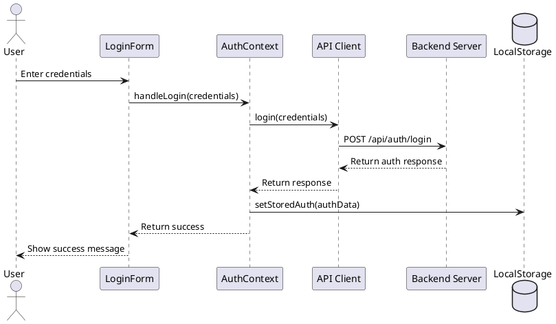
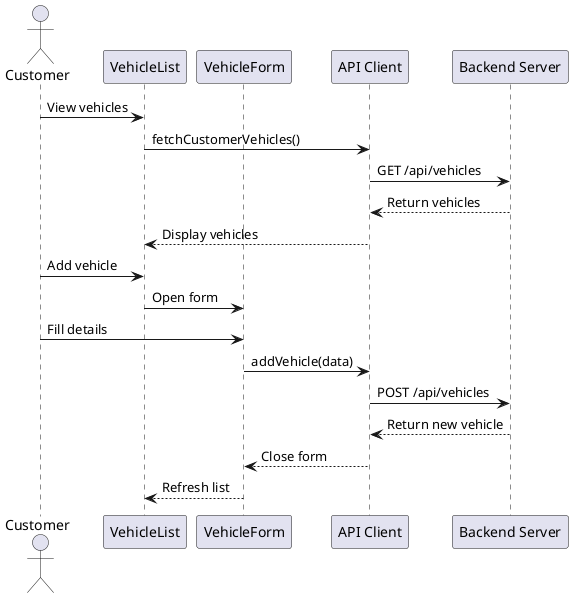
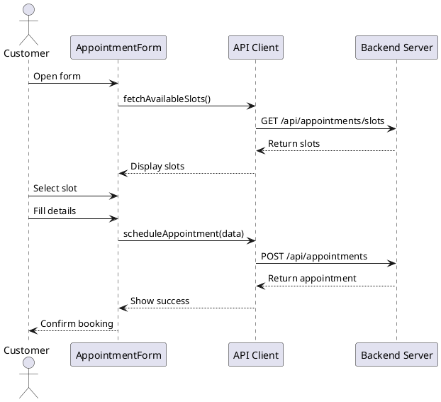

# Garage Management System Documentation

## Table of Contents
1. [Business Analysis](#business-analysis)
2. [System Architecture](#system-architecture)
3. [Database Design](#database-design)
4. [Entity Design](#entity-design)
5. [Sequence Diagrams](#sequence-diagrams)
6. [API Documentation](#api-documentation)
7. [Security Implementation](#security-implementation)

## Business Analysis

### 1.1 Project Overview
The Garage Management System is a comprehensive solution designed to streamline the operations of automotive service centers. The system facilitates vehicle service management, appointment scheduling, and customer relationship management.

### 1.2 Business Objectives
- Improve customer satisfaction through efficient service management
- Optimize resource allocation and scheduling
- Enhance communication between staff and customers
- Maintain accurate service records and history
- Streamline payment processing and invoicing

### 1.3 User Roles
1. **Customer**
   - Schedule appointments
   - View vehicle service history
   - Track service status
   - Make payments
   - Receive notifications

2. **Staff**
   - Manage appointments
   - Update service status
   - Record service details
   - Generate invoices
   - Handle customer inquiries

3. **Manager**
   - Oversee operations
   - Generate reports
   - Manage staff
   - Monitor performance metrics
   - Configure system settings

### 1.4 Key Features
- Vehicle management
- Appointment scheduling
- Service tracking
- Payment processing
- Customer notifications
- Reporting and analytics
- Inventory management
- Staff management

## System Architecture

### 2.1 Technology Stack
- **Frontend**: React with TypeScript
- **Backend**: Node.js with Express
- **Database**: PostgreSQL
- **Authentication**: JWT with refresh tokens
- **State Management**: React Context API
- **UI Framework**: Tailwind CSS

### 2.2 System Components
1. **Frontend Application**
   - User interface components
   - State management
   - API integration
   - Authentication handling

2. **Backend Services**
   - RESTful API
   - Authentication service
   - Business logic
   - Data persistence

3. **Database**
   - Data storage
   - Data relationships
   - Data integrity

## Database Design

### 3.1 Database Schema

```sql
-- Users Table
CREATE TABLE users (
    id SERIAL PRIMARY KEY,
    username VARCHAR(50) UNIQUE NOT NULL,
    email VARCHAR(100) UNIQUE NOT NULL,
    password_hash VARCHAR(255) NOT NULL,
    first_name VARCHAR(50),
    last_name VARCHAR(50),
    role VARCHAR(20) NOT NULL,
    created_at TIMESTAMP DEFAULT CURRENT_TIMESTAMP,
    updated_at TIMESTAMP DEFAULT CURRENT_TIMESTAMP
);

-- Vehicles Table
CREATE TABLE vehicles (
    id SERIAL PRIMARY KEY,
    customer_id INTEGER REFERENCES users(id),
    make VARCHAR(50) NOT NULL,
    model VARCHAR(50) NOT NULL,
    year INTEGER NOT NULL,
    license_plate VARCHAR(20) UNIQUE NOT NULL,
    vin VARCHAR(17),
    color VARCHAR(30),
    mileage INTEGER,
    status VARCHAR(20) DEFAULT 'active',
    created_at TIMESTAMP DEFAULT CURRENT_TIMESTAMP,
    updated_at TIMESTAMP DEFAULT CURRENT_TIMESTAMP
);

-- Appointments Table
CREATE TABLE appointments (
    id SERIAL PRIMARY KEY,
    customer_id INTEGER REFERENCES users(id),
    vehicle_id INTEGER REFERENCES vehicles(id),
    service_type VARCHAR(100) NOT NULL,
    appointment_date TIMESTAMP NOT NULL,
    status VARCHAR(20) DEFAULT 'pending',
    description TEXT,
    estimated_duration INTEGER,
    estimated_cost DECIMAL(10,2),
    notes TEXT,
    created_at TIMESTAMP DEFAULT CURRENT_TIMESTAMP,
    updated_at TIMESTAMP DEFAULT CURRENT_TIMESTAMP
);

-- Services Table
CREATE TABLE services (
    id SERIAL PRIMARY KEY,
    appointment_id INTEGER REFERENCES appointments(id),
    service_name VARCHAR(100) NOT NULL,
    description TEXT,
    cost DECIMAL(10,2) NOT NULL,
    status VARCHAR(20) DEFAULT 'pending',
    completed_at TIMESTAMP,
    created_at TIMESTAMP DEFAULT CURRENT_TIMESTAMP,
    updated_at TIMESTAMP DEFAULT CURRENT_TIMESTAMP
);

-- Payments Table
CREATE TABLE payments (
    id SERIAL PRIMARY KEY,
    appointment_id INTEGER REFERENCES appointments(id),
    amount DECIMAL(10,2) NOT NULL,
    payment_method VARCHAR(50),
    status VARCHAR(20) DEFAULT 'pending',
    transaction_id VARCHAR(100),
    payment_date TIMESTAMP,
    created_at TIMESTAMP DEFAULT CURRENT_TIMESTAMP,
    updated_at TIMESTAMP DEFAULT CURRENT_TIMESTAMP
);
```

### 3.2 Database Relationships
- Users -> Vehicles (One-to-Many)
- Users -> Appointments (One-to-Many)
- Vehicles -> Appointments (One-to-Many)
- Appointments -> Services (One-to-Many)
- Appointments -> Payments (One-to-Many)

## Entity Design

### 4.1 User Entity
```typescript
interface User {
    id: number;
    username: string;
    email: string;
    firstName: string;
    lastName: string;
    roles: string[];
    createdAt: Date;
    updatedAt: Date;
}
```

### 4.2 Vehicle Entity
```typescript
interface Vehicle {
    id: number;
    customerId: number;
    make: string;
    model: string;
    year: number;
    licensePlate: string;
    vin?: string;
    color?: string;
    mileage: number;
    status: string;
    createdAt: Date;
    updatedAt: Date;
}
```

### 4.3 Appointment Entity
```typescript
interface Appointment {
    id: number;
    customerId: number;
    vehicleId: number;
    serviceType: string;
    appointmentDate: Date;
    status: string;
    description: string;
    estimatedDuration: number;
    estimatedCost: number;
    notes?: string;
    createdAt: Date;
    updatedAt: Date;
}
```

### 4.4 Service Entity
```typescript
interface Service {
    id: number;
    appointmentId: number;
    serviceName: string;
    description: string;
    cost: number;
    status: string;
    completedAt?: Date;
    createdAt: Date;
    updatedAt: Date;
}
```

### 4.5 Payment Entity
```typescript
interface Payment {
    id: number;
    appointmentId: number;
    amount: number;
    paymentMethod: string;
    status: string;
    transactionId?: string;
    paymentDate?: Date;
    createdAt: Date;
    updatedAt: Date;
}
```

## Sequence Diagrams

### 5.1 Login Flow


### 5.2 Vehicle Management Flow


### 5.3 Appointment Scheduling Flow


## API Documentation

### 6.1 Authentication Endpoints
```typescript
// Login
POST /api/auth/login
Request: {
    username: string;
    password: string;
}
Response: {
    token: string;
    user: User;
}

// Refresh Token
POST /api/auth/refresh
Request: {
    refreshToken: string;
}
Response: {
    accessToken: string;
    refreshToken: string;
}
```

### 6.2 Vehicle Endpoints
```typescript
// Get Customer Vehicles
GET /api/vehicles
Response: Vehicle[]

// Add Vehicle
POST /api/vehicles
Request: {
    make: string;
    model: string;
    year: number;
    licensePlate: string;
    vin?: string;
    color?: string;
    mileage: number;
}
Response: Vehicle

// Update Vehicle
PUT /api/vehicles/:id
Request: {
    make?: string;
    model?: string;
    year?: number;
    licensePlate?: string;
    vin?: string;
    color?: string;
    mileage?: number;
}
Response: Vehicle
```

### 6.3 Appointment Endpoints
```typescript
// Get Appointments
GET /api/appointments
Response: Appointment[]

// Schedule Appointment
POST /api/appointments
Request: {
    vehicleId: number;
    serviceType: string;
    appointmentDate: string;
    description: string;
    estimatedDuration: number;
    estimatedCost: number;
    notes?: string;
}
Response: Appointment

// Update Appointment
PUT /api/appointments/:id
Request: {
    status?: string;
    description?: string;
    estimatedDuration?: number;
    estimatedCost?: number;
    notes?: string;
}
Response: Appointment
```

## Security Implementation

### 7.1 Authentication
- JWT-based authentication
- Refresh token mechanism
- Token expiration handling
- Secure password hashing

### 7.2 Authorization
- Role-based access control
- Route protection
- API endpoint security
- Resource access control

### 7.3 Data Security
- Input validation
- SQL injection prevention
- XSS protection
- CSRF protection

### 7.4 Security Best Practices
- HTTPS enforcement
- Secure headers
- Rate limiting
- Error handling
- Logging and monitoring

## Conclusion
This documentation provides a comprehensive overview of the Garage Management System, including its business requirements, technical architecture, database design, and security implementation. The system is designed to be scalable, maintainable, and secure while providing a seamless experience for both customers and staff. 